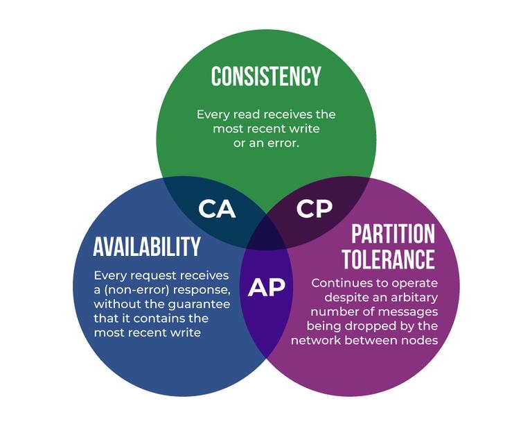
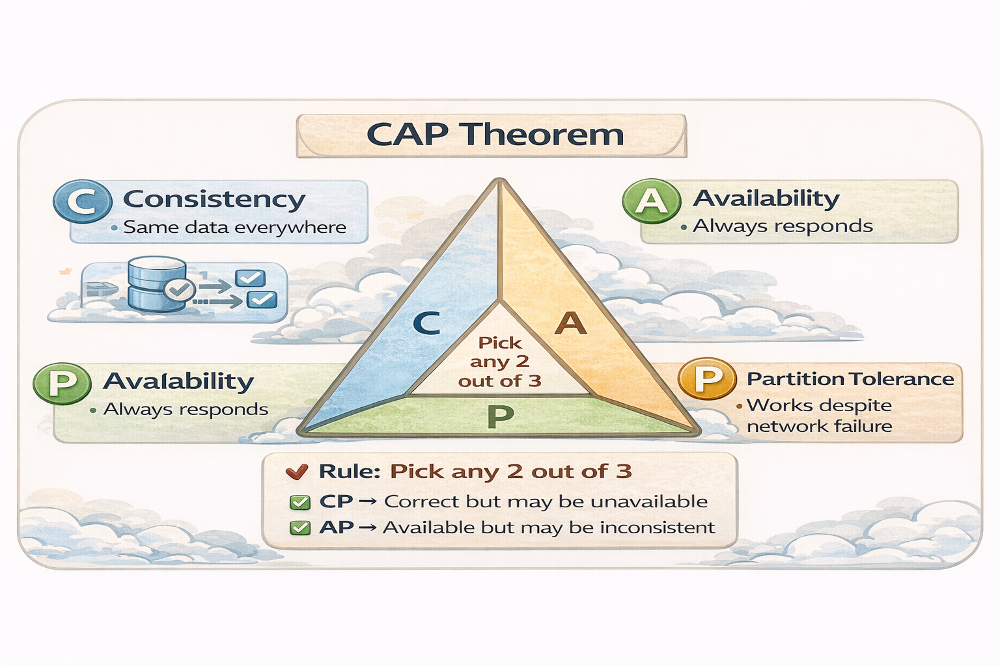

# 📘 CAP + PACELC Theorem (With Diagrams & Examples)

---

## 🖼️ CAP Theorem Visual

---

<strong>🔹 CAP Theorem (Click to expand)</strong>

### Rule
- Consistency (C)
- Availability (A)
- Partition Tolerance (P)

👉 Pick any **2 out of 3**

---

### Key Decision

When partition happens:
- Choose **CP** → Correct but may reject requests
- Choose **AP** → Always respond but may be inconsistent

---

### Examples

| Type | Systems | Use Case |
|------|--------|---------|
| CP | HBase, ZooKeeper | Banking, coordination |
| AP | Cassandra, DynamoDB | Feeds, streaming |

---

## 🖼️ PACELC Flow

---

<strong>🔹 PACELC Theorem (Click to expand)</strong>

### Rule

If Partition (P):
- Choose Availability (A) or Consistency (C)

Else (E):
- Choose Latency (L) or Consistency (C)

---

### Key Insight

| Scenario | Choice |
|---------|--------|
| Failure | A vs C |
| Normal  | L vs C |

---

### Examples

| Choice | Systems |
|--------|--------|
| CP | HBase, ZooKeeper |
| AP/EL | Cassandra, DynamoDB |
| EC | Spanner |

---

## 🔄 Combined Understanding

<strong>Click to expand</strong>

### CAP = Failure Mode Decision  
### PACELC = Always-on Decision Framework  

- CAP only talks about **partition**
- PACELC talks about **both failure and normal operation**

---

### Real System Mapping

| System | CAP | PACELC |
|-------|-----|--------|
| Cassandra | AP | PA/EL |
| DynamoDB | AP | PA/EL |
| HBase | CP | PC/EC |
| Spanner | CP | PC/EC |

---

## 📌 Final Insight

> CAP tells you what to do during failure  
> PACELC tells you what to do always

